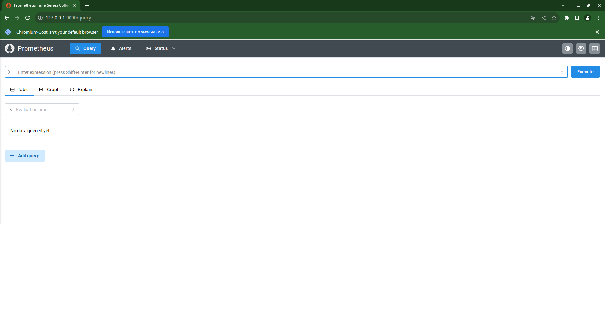
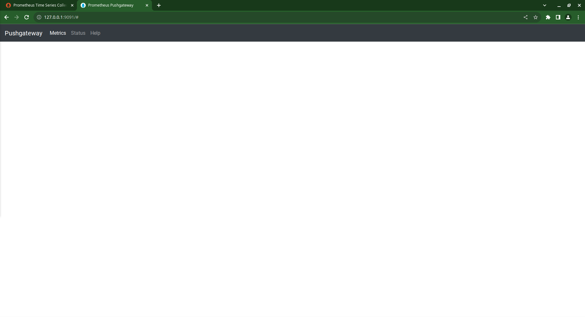
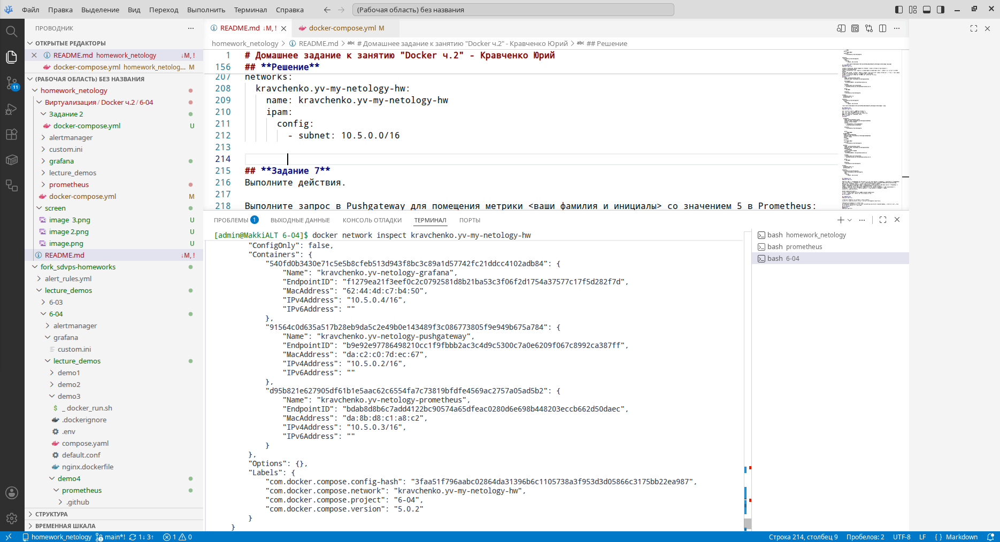
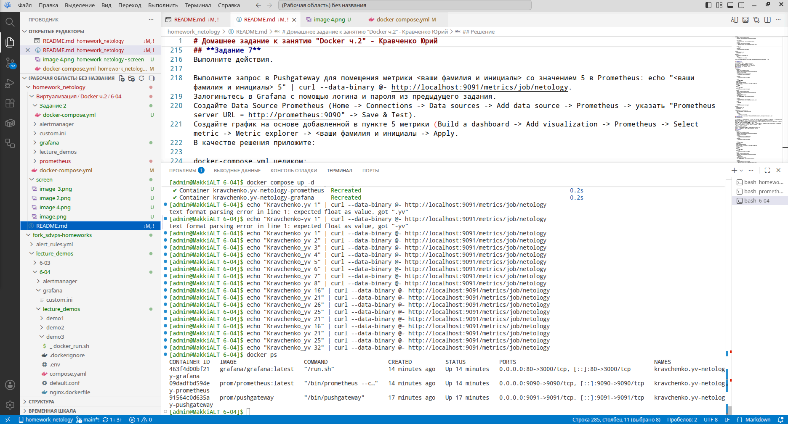
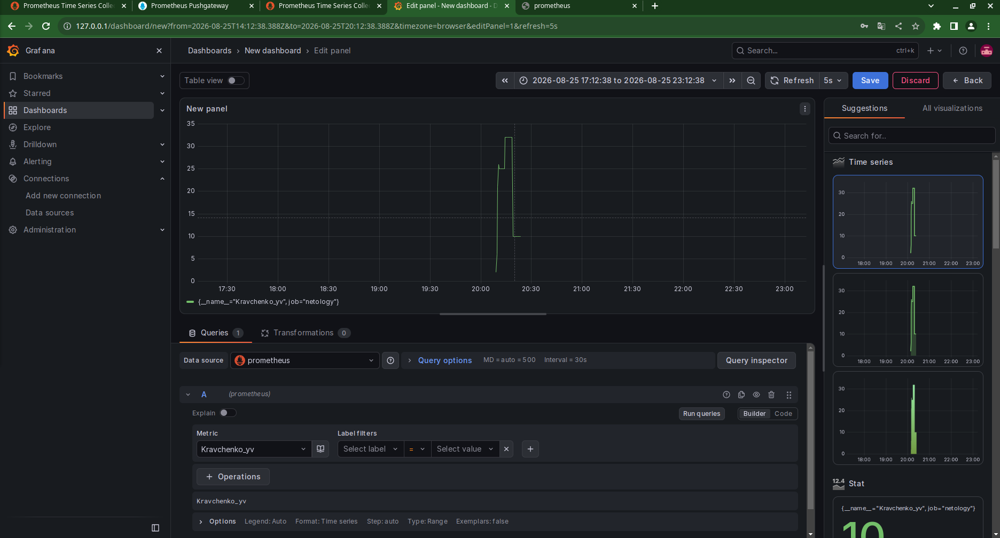
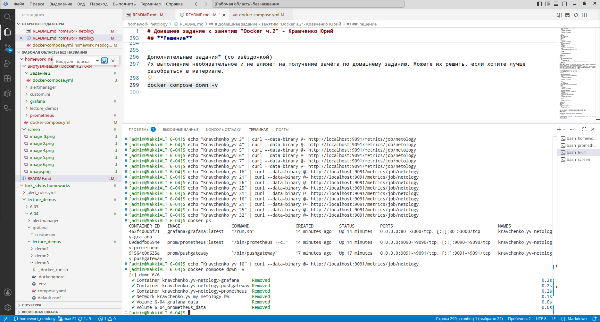

# Домашнее задание к занятию "Docker ч.2" - Кравченко Юрий

Инструкция по выполнению домашнего задания
Сделайте fork данного репозитория к себе в Github и переименуйте его по названию или номеру занятия, например, https://github.com/имя-вашего-репозитория/git-hw или https://github.com/имя-вашего-репозитория/7-1-ansible-hw).
Выполните клонирование данного репозитория к себе на ПК с помощью команды git clone.
Выполните домашнее задание и заполните у себя локально этот файл README.md:
впишите вверху название занятия и вашу фамилию и имя
в каждом задании добавьте решение в требуемом виде (текст/код/скриншоты/ссылка)
для корректного добавления скриншотов воспользуйтесь инструкцией "Как вставить скриншот в шаблон с решением
при оформлении используйте возможности языка разметки md (коротко об этом можно посмотреть в инструкции по MarkDown)
После завершения работы над домашним заданием сделайте коммит (git commit -m "comment") и отправьте его на Github (git push origin);
В личном кабинете прикрепите и отправьте ссылку на решение в виде md-файла в вашем Github.
Любые вопросы по выполнению заданий спрашивайте в разделе “Вопросы по заданию” в личном кабинете.
Желаем успехов в выполнении домашнего задания!

Дополнительные материалы, которые могут быть полезны для выполнения задания
Руководство по оформлению Markdown файлов

## **Задание 1**
Напишите ответ в свободной форме, не больше одного абзаца текста.

Установите Docker Compose и опишите, для чего он нужен и как может улучшить лично вашу жизнь.

## **Ответ**
Docker compose это инcтрумент оптимизации времени и ресурсов при поднятии групп микросервисов, которые состоят не только из одного контейнера. Благодаря ему можно задать декларативную структуру требуемых контейнеров с необходимыми настройками при поднятии.

## **Задание 2**
Выполните действия и приложите текст конфига на этом этапе.

Создайте файл docker-compose.yml и внесите туда первичные настройки:

version;
services;
volumes;
networks.
При выполнении задания используйте подсеть 10.5.0.0/16. Ваша подсеть должна называться: <ваши фамилия и инициалы>-my-netology-hw. Все приложения из последующих заданий должны находиться в этой конфигурации.
## **Решение**

```services:
  Homework:
    image: alt:latest
    networks:
     - kravchenko.yv-my-netology-hw
volumes:
  vol1: {}
  vol2: {}
networks:
  kravchenko.yv-my-netology-hw:
    ipam:
      config:
        - subnet: 10.5.0.0/16
```

## **Задание 3**
*Выполните действия:*

Создайте конфигурацию docker-compose для Prometheus с именем контейнера <ваши фамилия и инициалы>-netology-prometheus.
Добавьте необходимые тома с данными и конфигурацией (конфигурация лежит в репозитории в директории 6-04/prometheus ).
Обеспечьте внешний доступ к порту 9090 c докер-сервера.
## **Решение**
docker-compose.yml
```
services:

  prometheus:
    image: prom/prometheus:latest
    container_name: kravchenko.yv-netology-prometheus

    volumes:
      - ./prometheus/:/etc/prometheus/
      - prometheus_data:/prometheus

    networks:
      - kravchenko.yv-my-netology-hw


    ports:
      - "9090:9090"

volumes:
  prometheus_data: {}

networks:
  6-04_kravchenko.yv-my-netology-hw:
    external: true
```
    


## **Задание 4**
Выполните действия:

Создайте конфигурацию docker-compose для Pushgateway с именем контейнера <ваши фамилия и инициалы>-netology-pushgateway.
Обеспечьте внешний доступ к порту 9091 c докер-сервера.
## **Решение**
```
pushgateway:
   image: prom/pushgateway
   container_name: kravchenko.yv-netology-pushgateway
   restart: always
   expose:
      - 9091
   ports:
      - "9091:9091"
   networks:
      - kravchenko.yv-my-netology-hw


networks:
  kravchenko.yv-my-netology-hw:
    ipam:
      config:
        - subnet: 10.5.0.0/16


```
## **Задание 5**
Выполните действия:

Создайте конфигурацию docker-compose для Grafana с именем контейнера <ваши фамилия и инициалы>-netology-grafana.
Добавьте необходимые тома с данными и конфигурацией (конфигурация лежит в репозитории в директории 6-04/grafana.
Добавьте переменную окружения с путем до файла с кастомными настройками (должен быть в томе), в самом файле пропишите логин=<ваши фамилия и инициалы> пароль=netology.
Обеспечьте внешний доступ к порту 3000 c порта 80 докер-сервера.
## **Решение**
```
grafana:
    image: grafana/grafana:latest
    container_name: kravchenko.yv-netology-grafana

    environment:
      GF_PATHS_CONFIG: /etc/grafana/custom.ini

    volumes:
    - grafana_data:/var/lib/grafana
    - ./grafana/custom.ini:/etc/grafana/custom.ini:ro

    ports:
    - "80:3000"

    networks:
    - kravchenko.yv-my-netology-hw

volumes:
  prometheus_data: {}
  grafana_data: {}

networks:
  kravchenko.yv-my-netology-hw:
    ipam:
      config:
        - subnet: 10.5.0.0/16
```
![alt text](screen/image3.png

## **Задание 6**
Выполните действия.

Настройте поочередность запуска контейнеров.
Настройте режимы перезапуска для контейнеров.
Настройте использование контейнерами одной сети.
Запустите сценарий в detached режиме.
## **Решение**
```
services:

  prometheus:
    image: prom/prometheus:latest
    container_name: kravchenko.yv-netology-prometheus
    restart: unless-stopped
    volumes:
      - ./prometheus/:/etc/prometheus/
      - prometheus_data:/prometheus

    networks:
      - kravchenko.yv-my-netology-hw


    ports:
      - "9090:9090"
  pushgateway:
   image: prom/pushgateway
   container_name: kravchenko.yv-netology-pushgateway
   restart: always
   expose:
      - 9091
   ports:
      - "9091:9091"
   networks:
      - kravchenko.yv-my-netology-hw

  grafana:
    image: grafana/grafana:latest
    container_name: kravchenko.yv-netology-grafana
    depends_on:
      - prometheus
    restart: unless-stopped
    environment:
      GF_PATHS_CONFIG: /etc/grafana/custom.ini

    volumes:
    - grafana_data:/var/lib/grafana
    - ./grafana/custom.ini:/etc/grafana/custom.ini:ro

    ports:
    - "80:3000"

    networks:
    - kravchenko.yv-my-netology-hw

volumes:
  prometheus_data: {}
  grafana_data: {}

networks:
  kravchenko.yv-my-netology-hw:
    name: kravchenko.yv-my-netology-hw
    ipam:
      config:
        - subnet: 10.5.0.0/16


```

## **Задание 7**
Выполните действия.

Выполните запрос в Pushgateway для помещения метрики <ваши фамилия и инициалы> со значением 5 в Prometheus: echo "<ваши фамилия и инициалы> 5" | curl --data-binary @- http://localhost:9091/metrics/job/netology.
Залогиньтесь в Grafana с помощью логина и пароля из предыдущего задания.
Cоздайте Data Source Prometheus (Home -> Connections -> Data sources -> Add data source -> Prometheus -> указать "Prometheus server URL = http://prometheus:9090" -> Save & Test).
Создайте график на основе добавленной в пункте 5 метрики (Build a dashboard -> Add visualization -> Prometheus -> Select metric -> Metric explorer -> <ваши фамилия и инициалы -> Apply.
В качестве решения приложите:

docker-compose.yml целиком;
скриншот команды docker ps после запуске docker-compose.yml;
скриншот графика, построенного на основе вашей метрики.
## **Решение**
```
services:

  prometheus:
    image: prom/prometheus:latest
    container_name: kravchenko.yv-netology-prometheus
    restart: unless-stopped
    volumes:
      - ./prometheus/:/etc/prometheus/
      - prometheus_data:/prometheus

    networks:
      - kravchenko.yv-my-netology-hw


    ports:
      - "9090:9090"
  pushgateway:
   image: prom/pushgateway
   container_name: kravchenko.yv-netology-pushgateway
   restart: always
   expose:
      - 9091
   ports:
      - "9091:9091"
   networks:
      - kravchenko.yv-my-netology-hw

  grafana:
    image: grafana/grafana:latest
    container_name: kravchenko.yv-netology-grafana
    depends_on:
      - prometheus
    restart: unless-stopped
    environment:
      GF_PATHS_CONFIG: /etc/grafana/custom.ini

    volumes:
    - grafana_data:/var/lib/grafana
    - ./grafana/custom.ini:/etc/grafana/custom.ini:ro

    ports:
    - "80:3000"

    networks:
    - kravchenko.yv-my-netology-hw

volumes:
  prometheus_data: {}
  grafana_data: {}

networks:
  kravchenko.yv-my-netology-hw:
    name: kravchenko.yv-my-netology-hw
    ipam:
      config:
        - subnet: 10.5.0.0/16
```



## **Задание 8**
Выполните действия:

Остановите и удалите все контейнеры одной командой.
В качестве решения приложите скриншот консоли с проделанными действиями.
## **Решение**


Дополнительные задания* (со звёздочкой)
Их выполнение необязательное и не влияет на получение зачёта по домашнему заданию. Можете их решить, если хотите лучше разобраться в материале.
```
docker compose down -v
```

